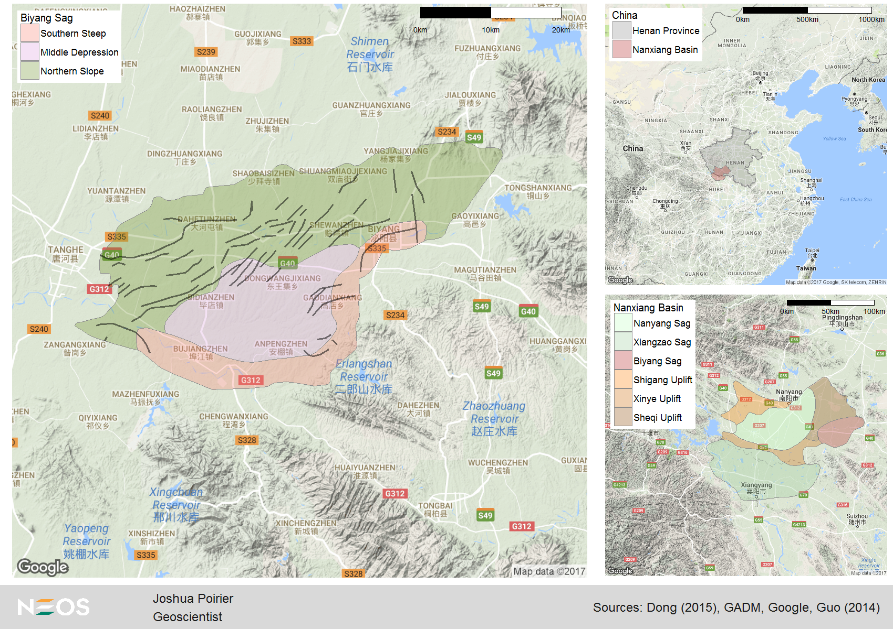
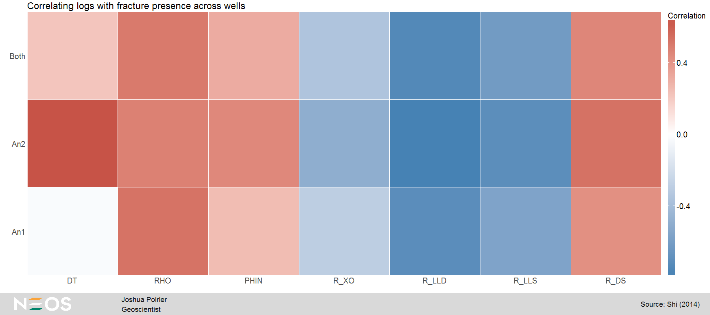
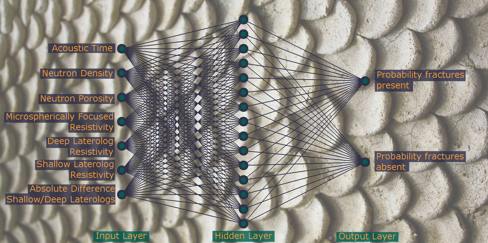
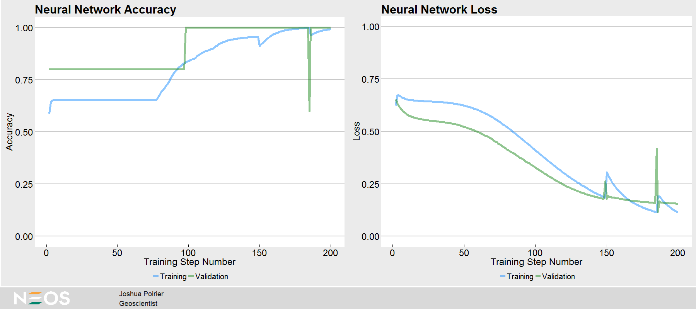

## Identifying fractures using neural networks  
Author: Joshua Poirier, Geoscientist  
May 2017  

### Abstract  
In this study I will identify fractures by feeding well log data into a neural
network. This data has practical value when the data of the imaging log and core
samples are limited. This case study comes from Guangren Shi's chapter on
Artificial Neural Networks from his book "Data Mining and Knowledge Discovery
for Geoscientists." You can purchase the book from [Amazon](https://www.amazon.com/Data-Mining-Knowledge-Discovery-Geoscientists/dp/0124104371/ref=sr_1_1?ie=UTF8&qid=1490908644&sr=8-1&keywords=data+mining+and+knowledge+discovery+for+geoscientists+%2B+guangren+shi) or directly from the publisher, [Elsevier](https://www.elsevier.com/books/data-mining-and-knowledge-discovery-for-geoscientists/shi/978-0-12-410437-2).  

### Introduction  

Shi describes the study location as follows:

> Located southeast of the Biyang Sag in Nanxiang Basin in central China, the Anpeng Oil-field covers an area of about 17.5 square kilometers, close to Tanghe-zaoyuan in the northwest-west, striking a large boundary fault in the south, and close to a deep sag in the east. As an inherited nose structure plunging from northwest to southeast, this oilfield is a simple structure without faults, where commercial oil and gas flows have been discovered (Ming et al., 2005; Wang et al., 2006). One of its favorable pool-forming conditions is that the fractures are found to be well developed at formations as deep as 2800 m or more. These fractures provide favorable oil-gas migration pathways and enlarged the accumulation space.

Augmenting Shi's description with the work of Dong (2015) and Guo (2014) I was
able to build the following map. In the upper-right we see the location of the
Nanxiang Basin in central China. The basin is split into sags and uplifts as
shown in the lower-right - we're focused on the Biyang Sag in red. The left
image shows the Biyang Sag in detail. Shi describes the oilfield as being a
simple structure without faults. This is consistent with Guo (2014) as we see
no mapped faults near Anpengzhen on the map.  

  

The above map was made using the R script *mapping.R*.

The data was transcribed from Shi's book and includes data from 33 samples in
wells An1 and An2. For more information, see the
[data codebook](https://github.com/joshuaadampoirier/ggdoc_casestudy/tree/master/data).

| Variable name | Description                                                  |
| ------------- | ------------------------------------------------------------ |
| Sample        | Sample number                                                |
| Well          | Well number                                                  |
| Depth         | Measured depth in meters                                     |
| DT            | Acoustic time                                                |
| RHO           | Compensated neutron density                                  |
| PHIN          | Compensated neutron porosity                                 |
| R_XO          | Microspherically focused resistivity                         |
| R_LLD         | Deep laterolog resistivity                                   |
| R_LLS         | Shallow laterolog resistivity                                |
| R_DS          | Absolute difference between R_LLD and R_LLS                  |
| IL            | Fracture identification determined by imaging log (1=fracture, 2=nonfracture) |  

### Exploring the Data  

The data is sampled where imaging log observations are present. This irregular
sampling interval won't lend itself to a traditional plot of logs. Instead I'll
plot the correlations between the logs and fracture presence.

  

Reds show positive correlation and blues show negative correlation. The stronger
the color, the stronger the correlation! We can see that the correlations are
consistent across wells with the exception of the *DT* log which exhibits little
correlation in *An1*. While there are some stronger correlations present, no log
by itself will definitively determine fracture presence.   

### Splitting the Data  

In order to evaluate my final model I'm going to split the data into training
and testing data subsets. I'll use samples 1-29 as training data to build the
neural network and evaluate the neural networks performance on samples 30-33 (as
Shi did). In addition, I'll randomly hold 15% of the training data as a
validation set. If I were to tune hyperparameters based on the testing set, the
testing set would end up bleeding into the training process. Using a validation
set will help avoid overfitting.

### Neural Networks  

Neural networks and deep learning are biologically-inspired machine learning
techniques for identifying complex patterns in data (Nielsen, 2015). Data is fed
forward from the input layer through the network to the output layer. Each
neuron in the hidden and output layer has a value - the weighted sum of the
neurons in the previous layer. The following figure shows the architecture of
the network I use in this study. There are 7 input neurons (representing the 7
well logs), 15 hidden neurons identifying the complex, nonlinear patterns in the
data, and 2 output neurons (representing the probability of fracture presence
and absence respectively). This follows Shi's approach.  

[TFLearn](http://tflearn.org) is a Python package that allows you to build a
neural network by defining the layers. It does a lot of the heavy lifting for
me - so I don't have to code weight initialization, feed-forward propogation, or
the backward propogation of errors through the network. I can simply focus on
the architecture of the network.  

### Training and Evaluating the Network  

Over many training steps, the neural network learns the nonlinear data patterns
corresponding to whether or not fractures are present. The network is trained
and validated using the Python script *build_network.py*.  

Near step 100 the network starts correctly identifying fracture presence/absence
with 100% accuracy (as determined from the validation data set). This is shown
(along with the training *loss*) in the above figure, created using the R script *nn-performance_plotting.R*.

After 200 training steps, I tested the network on my hold-out data. It correctly
predicted fracture presence/absence with 100% accuracy!  

### Conclusions  

This study demonstrates that neural networks can be used to correctly identify
fracture presence using well log data. The model can now be applied to well log
data elsewhere in the Nanxiang Basin to identify fractures. We can begin chasing
zones where fractures are present as they provide favorable oil-gas migration
pathways and increased pore space.  

Further, this approach could be applied in other basins around the world to
identify fractures. Fracture presence in conventional sandstone or carbonate
plays can be beneficial (as here in the Nanxiang Basin). In unconventional plays
fractures may absorb frac energy, so we may want to avoid fractures in this
case. Either way, knowing where fractures are is critical to your operation.

In future studies, larger data sets would be desirable. With more data, you may
need to make some adjustments to your network to achieve strong results. Here's
a few things you may want to consider when creating your own neural networks:

* Add additional hidden layers to learn more complex patterns (deep learning)  
* Regularization (L2-Regularization, Dropout)  
* Convolutional Neural Networks (CNN)  
* Recurrent Neural Networks (RNN)  
* Manually initialize weights and biases  
* More training steps

### References  

Abadi, Martin et al. [TensorFlow: Large-scale machine learning on heterogeneous systems](http://tensorflow.org). tensorflow.org. 2015.  

Damien, Aymeric et al. [TFLearn](http://tflearn.org/). GitHub. 2016.  

Dong, Yanlei et al. [Seismic geomorphology study of the Paleogene Hetaoyuan Formation, central-south Biyang Sag, Nanxiang Basin, China](https://doi.org/10.1016/j.marpetgeo.2015.02.042).
Marine and Petroleum Geology. Vol. 64 June 2015.  

Guo, Pengfei et al. [Formation and Identification of Unresolved Complex Mixtures
in Lacustrine Biodegraded Oil from Nanxiang Basin, China](http://dx.doi.org/10.1155/2014/102576).
The Scientific World Journal, Vol. 2014.  

Hahnloser, R. et al. [Digital selection and analogue amplification coexist in a cortex-inspired silicon circuit](https://www.nature.com/nature/journal/v405/n6789/full/405947a0.html).
Nature. Vol. 405. June 2000.  

Kahle, D. and Wickham, H. [ggmap: Spatial Visualization with ggplot2](http://journal.r-project.org/archive/2013-1/kahle-wickham.pdf).
The R Journal, 5(1).  

LeCun, Yann et al. [Deep learning](http://www.nature.com/nature/journal/v521/n7553/full/nature14539.html).
Nature. Vol. 521. May 2015.  

Nielsen, Michael A. [Neural Networks and Deep Learning](http://neuralnetworksanddeeplearning.com).
Determination Press. 2015.

Poirier, Joshua. [ggdocumentation](https://github.com/joshuaadampoirier/ggdocumentation).
GitHub. 2017.  

Shi, Gaungren, 2014. Data Mining and Knowledge Discovery for Geoscientists.
  Petroleum Industry Press, Elsevier.  
