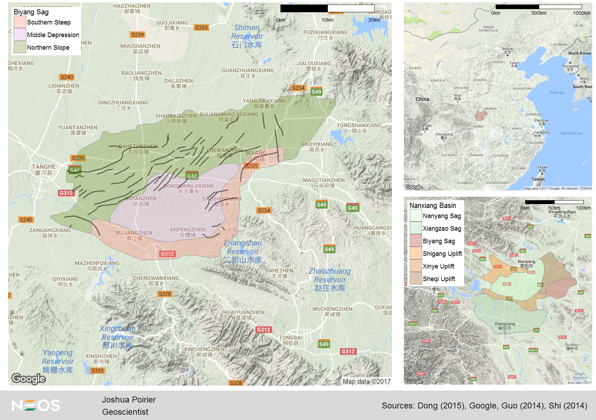
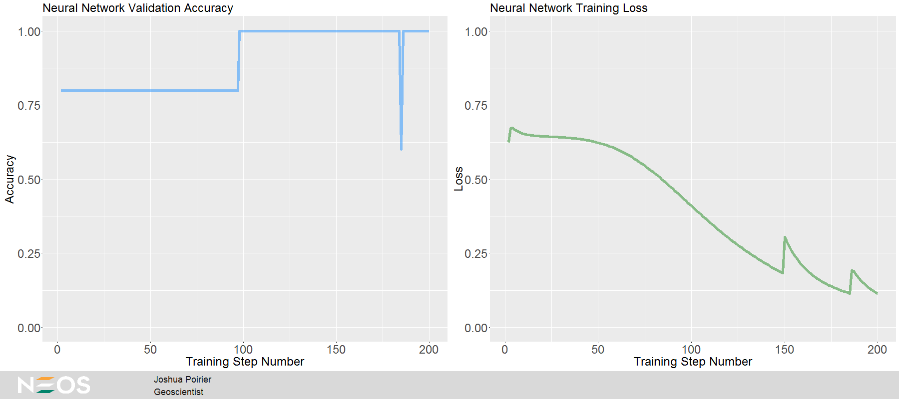

## 1 Cheaper, Faster way to Identify Fractures  
Joshua Poirier  
Geoscientist  
NEOS  
May 2017  

### Abstract  
One cheaper, faster way to identify fractures is to predict their presence
using conventional well-logging data and neural networks. This data has
practical value when the data of the imaging log and core samples are limited.
This case study comes from Guangren Shi's chapter on Artificial Neural Networks
from his book "Data Mining and Knowledge Discovery for Geoscientists." You can
purchase the book from [Amazon](https://www.amazon.com/Data-Mining-Knowledge-Discovery-Geoscientists/dp/0124104371/ref=sr_1_1?ie=UTF8&qid=1490908644&sr=8-1&keywords=data+mining+and+knowledge+discovery+for+geoscientists+%2B+guangren+shi) or directly from the publisher, [Elsevier](https://www.elsevier.com/books/data-mining-and-knowledge-discovery-for-geoscientists/shi/978-0-12-410437-2).  

### Introduction  

Shi describes the study location as follows:

> Located southeast of the Biyang Sag in Nanxiang Basin in central China, the Anpeng Oil-field covers an area of about 17.5 square kilometers, close to Tanghe-zaoyuan in the northwest-west, striking a large boundary fault in the south, and close to a deep sag in the east. As an inherited nose structure plunging from northwest to southeast, this oilfield is a simple structure without faults, where commercial oil and gas flows have been discovered (Ming et al., 2005; Wang et al., 2006). One of its favorable pool-forming conditions is that the fractures are found to be well developed at formations as deep as 2800 m or more. These fractures provide favorable oil-gas migration pathways and enlarged the accumulation space.

Augmenting Shi's description with the work of Dong (2015) and Guo (2014) I was
able to build the following map. In the upper-right we see the location of the
Nanxiang Basin in central China. The basin is split into sags and uplifts as
shown in the lower-right - we're focused on the Biyang Sag in red. The left
image shows the Biyang Sag in detail. Shi describes the oilfield as being a
simple structure without faults. This is consistent with Guo (2014) as we see
no mapped faults near Anpengzhen on the map. Unfortunately, the well locations
are not available. While this won't prevent me from moving forward with the
study, it does limit the geologic context for my solution.

  

The above map was made using the R script *mapping_functions.R*.

The data was transcribed from Shi's book and includes data from 33 samples in
wells An1 and An2, of which he used 29 as learning samples; holding out 4 as a
test set to evaluate the accuracy of his model. The data features available are
summarized below. Units are not given as each log has been normalized over the
interval [0, 1].

| Variable name | Description                                                  |
| ------------- | ------------------------------------------------------------ |
| Sample        | Sample number                                                |
| Well          | Well number                                                  |
| Depth         | Measured depth in meters                                     |
| DT            | Acoustic time                                                |
| RHO           | Compensated neutron density                                  |
| PHIN          | Compensated neutron porosity                                 |
| R_XO          | Microspherically focused resistivity                         |
| R_LLD         | Deep laterolog resistivity                                   |
| R_LLS         | Shallow laterolog resistivity                                |
| R_DS          | Absolute difference between R_LLD and R_LLS                  |
| IL            | Fracture identification determined by imaging log (1=fracture, 2=nonfracture) |  

### Exploring the Data  

The following table shows a preview of the first five rows of the data.  

| Sample | Well | Depth   | DT     | RHO    | PHIN   | R_XO   | R_LLD  | R_LLS  | R_DS   | IL |
| ------ | ---- | ------- | ------ | ------ | ------ | ------ | ------ | ------ | ------ | -- |
| 1      | An1  | 3065.13 | 0.5557 | 0.2516 | 0.8795 | 0.3548 | 0.6857 | 0.6688 | 0.0169 | 1  |
| 2      | An1  | 3089.68 | 0.9908 | 0.0110 | 0.8999 | 0.6792 | 0.5421 | 0.4071 | 0.1350 | 1  |
| 3      | An1  | 3098.21 | 0.4444 | 0.1961 | 0.5211 | 0.7160 | 0.7304 | 0.6879 | 0.0425 | 1  |
| 4      | An1  | 3102.33 | 0.4028 | 0.3506 | 0.5875 | 0.6218 | 0.6127 | 0.5840 | 0.0287 | 1  |
| 5      | An1  | 3173.25 | 0.3995 | 0.3853 | 0.0845 | 0.5074 | 0.8920 | 0.8410 | 0.0510 | 1  |  

The data is sampled where imaging log observations are present. This is
irregular sampling so a traditional plot of logs isn't going to be terribly
helpful. Instead I'll plot the correlations between the logs and fracture
presence.

  

Reds show positive correlation and blues show negative correlation. The stronger
the color, the stronger the correlation! We can see that the correlations are
consistent across wells with the exception of the *DT* log which exhibits little
correlation in *An1*. While there are some stronger correlations present, no log
by itself will definitively determine fracture presence.   

### Splitting the Data  

In order to evaluate my final model I'm going to split the data into training
and testing data subsets. I'll use samples 1-29 as training data to build the
neural network and evaluate the neural networks performance on samples 30-33 (as
Shi did). In addition, I'll randomly hold 15% of the training data as a
validation set. If I were to tune hyperparameters based on the testing set, the
testing set would end up bleeding into the training process. Using a validation
set will help avoid overfitting.

### Network Architecture  

[TFLearn](http://tflearn.org) is a Python package that allows you to build a
neural network by defining the layers. It does a lot of the heavy lifting for
me - so I don't have to code weight initialization, feed-forward propogation, or
the backward propogation of errors through the network. I can simply focus on
the architecture of the network.  

For this network I only deviated from Shi's work mildly. Like Shi, I use 7 input
neurons corresponding to the well logs we're using to train the network. Like
Shi, my hiden layer has 15 neurons. Deviating from Shi, I use *rectified
linear units (ReLU)* for the activation function. Shi uses sigmoids for the
activations. ReLU's were first used in a network by Hahnloser et al. (2000) and
(as per LeCun 2015) have since become the most popular activation function for
deep learning. The output layer (two neurons - one indicating fracture presence,
the other indicating absence) utilizes the *softmax* activation function to
ensure the outputs sum to 1, and can be interpreted as probabilities of fracture
presence/absence. The architecture is shown in the figure below.

### Training and Evaluating the Network  

To learn, TFLearn feeds the input data forward through the network and
calculates the probability of fracture presence. Given that TFLearn initializes
the weights randomly, it's first forward pass is ostensibly not different from
guessing.

For each training point I know whether or not fractures are present. This
information has been converted into a number by saying there is 100% probability
of fracture presence (or 0% for fracture absent observations). If the network
calculates, let's say 60% probability of fracture presence, then we say there
are fractures (because it's >50%). The network predicted accurately; however,
it is still off by 40% (we want it to say 100% probability!). This is the
difference between *accuracy* and *loss*. The network then backpropogates the
loss backwards through the network and updates the weights using gradient
descent. The next step of feed-forward and backpropogation then begins.  

Over many training steps, the neural network learns the nonlinear data patterns
corresponding to the classifications. The network is trained and validated using
the Python script *build_network.py*.  

There is some noise as the optimizer tries to minimize the loss, the validation
accuracy reaches 100% near step 100 and the loss seems to stabilize to 0.15
around step 200. This is shown in the following figure, created using the R
script *nn-performance_plotting_functions.R*.

When applying the trained network to my hold-out test data set it achieves 100%
accuracy. This neural network can correctly identify fractures from conventional
well-logging data!  

### Conclusions  

This study demonstrates that neural networks can be used to correctly identify
fracture presence using conventional well-logging data. The model can now be
applied to the full well log data set for wells An1 and An2 in the Biyang Sag of
the Nanxiang Basin, China. With the knowledge of fracture presence/absence with
depth, we can make business decisions such as what depths will make ideal perf
zones.  

With a larger data set my network may not perform as successfully. Additional
training data may require some adjustments to the neural network architecture. A
few things you may want to consider when applying neural networks to solve
problems like this one:

* Add additional hidden layers to learn more complex patterns (deep learning)  
* Regularization (L2-Regularization, Dropout)  
* Convolutional Neural Networks (CNN)  
* Recurrent Neural Networks (RNN)  
* Manually initialize weights and biases  
* More training steps

### References  

Abadi, Martin et al. [TensorFlow: Large-scale machine learning on heterogeneous systems](http://tensorflow.org). tensorflow.org. 2015.  

Damien, Aymeric et al. [TFLearn](http://tflearn.org/). GitHub. 2016.  

Dong, Yanlei et al. [Seismic geomorphology study of the Paleogene Hetaoyuan Formation, central-south Biyang Sag, Nanxiang Basin, China](https://doi.org/10.1016/j.marpetgeo.2015.02.042).
Marine and Petroleum Geology. Vol. 64 June 2015.  

Guo, Pengfei et al. [Formation and Identification of Unresolved Complex Mixtures
in Lacustrine Biodegraded Oil from Nanxiang Basin, China](http://dx.doi.org/10.1155/2014/102576).
The Scientific World Journal, Vol. 2014.  

Hahnloser, R. et al. [Digital selection and analogue amplification coexist in a cortex-inspired silicon circuit](https://www.nature.com/nature/journal/v405/n6789/full/405947a0.html).
Nature. Vol. 405. June 2000.  

Kahle, D. and Wickham, H. [ggmap: Spatial Visualization with ggplot2](http://journal.r-project.org/archive/2013-1/kahle-wickham.pdf).
The R Journal, 5(1).  

LeCun, Yann et al. [Deep learning](http://www.nature.com/nature/journal/v521/n7553/full/nature14539.html).
Nature. Vol. 521. May 2015.  

Poirier, Joshua. [ggdocumentation](https://github.com/joshuaadampoirier/ggdocumentation).
GitHub. 2017.  

Shi, Gaungren, 2014. Data Mining and Knowledge Discovery for Geoscientists.
  Petroleum Industry Press, Elsevier.  
